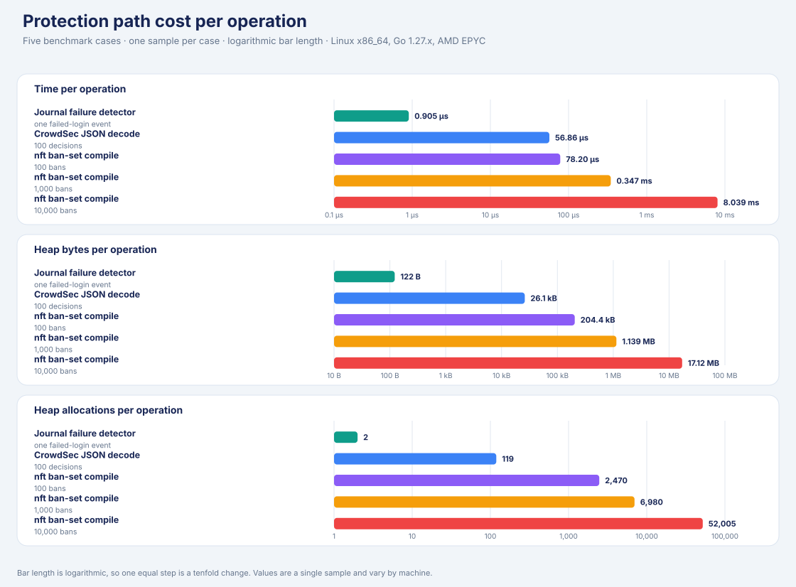
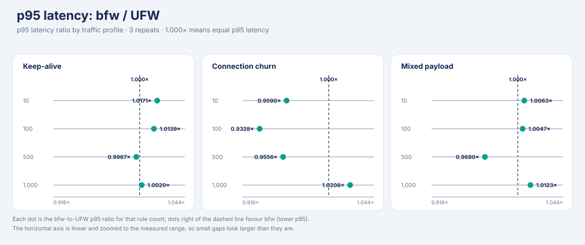
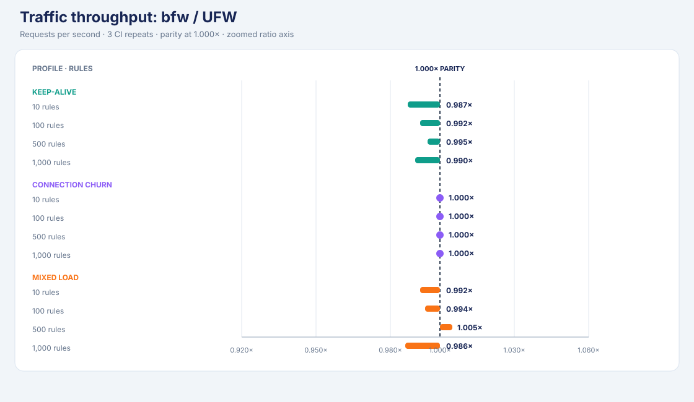
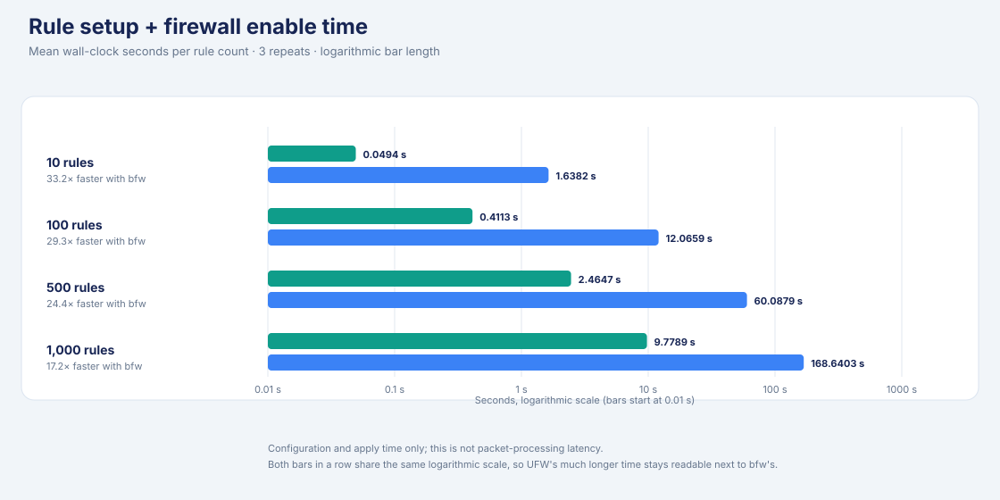
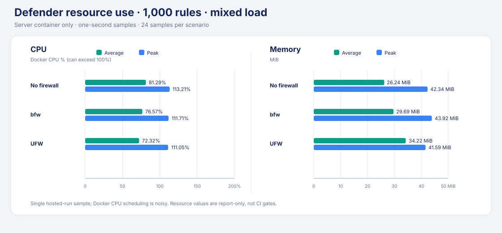

# better-firewall

**better-firewall (`bfw`)** is a Linux firewall manager built on nftables. It offers a familiar UFW-style command line, dual-stack rules, and optional login-abuse protection.

## What you get

- UFW-style rules, policies, logging, and application profiles.
- Atomic nftables updates for IPv4 and IPv6.
- Named IP sets, NAT, expiring rules, and health checks.
- Migration of supported rules from UFW, firewalld, iptables-persistent, and nftables.
- Optional journal-based bans and CrowdSec Local API decisions.

## Install

Requirements: Linux with nftables support and root to change the firewall. Go
1.22+ is required only when building from source.

Install the latest Linux release:

```sh
curl -fsSL https://github.com/tmih06/bfirewall/releases/latest/download/install.sh -o install-bfw.sh
sudo sh install-bfw.sh
```

Or build and install from source:

```sh
make build
sudo make install
```

Installation does **not** replace or disable another firewall manager. Review the rules and migration instructions before taking over an existing firewall.

## Start safely

Allow your actual SSH port and trusted source first. Then preview before enabling:

```sh
sudo bfw allow from 192.0.2.10 to any port 22 proto tcp
sudo bfw --dry-run enable
sudo bfw enable
sudo bfw status verbose
```

Replace `192.0.2.10` and port `22` with your administration address and SSH port. Enabling a deny-by-default firewall without an access rule can lock out remote users.

Useful commands:

| Need | Command |
|---|---|
| Add a rule | `bfw allow 443/tcp`, `bfw deny 23/tcp` |
| Check rules | `bfw status numbered`, `bfw check`, `bfw diff` |
| Preview changes | `bfw --dry-run reload` |
| Manage named addresses | `bfw set create NAME`, then `bfw set add NAME IP` |
| Add NAT | `bfw nat add masquerade out on IFACE` |
| Stop or restore traffic | `bfw disable`, `bfw enable` |

`bfw` can also be invoked as `ufw` for the supported UFW command grammar. `bfw panic` blocks all traffic; use it only when you intend to cut existing connections.

## Optional login protection

Run `bfw protect` to watch systemd journal records and apply temporary firewall bans. The default SSH jail ignores loopback, then bans an address for **1 hour after 5 failed logins within 10 minutes**. Failure counters are in memory; bans persist across restarts. This is Fail2ban-like behavior, not a flat-file Fail2ban replacement.

| Mode | Reads | Needs | Decision handling |
|---|---|---|---|
| Local jail | Configured journal identifiers and regex patterns | systemd journal; no external service | Counts failures, then adds a temporary ban |
| CrowdSec | CrowdSec LAPI decision stream | Bouncer key file; HTTPS (or HTTP on loopback) | Reconciles a startup snapshot, then applies IP/range `ban` deltas |
| Combined | Both sources | Same `bfw protect` service | Both use the same persisted nftables ban sets |

The optional systemd service is installed but not enabled automatically:

```sh
sudo systemctl enable --now better-firewall-protect.service
```

Expired bans are removed by the minutely sweep timer. The firewall service starts that timer; if you run protection without the firewall systemd service, enable `better-firewall-sweep.timer` too. Expiration may be enforced up to one minute late.

### Connect CrowdSec

On the LAPI host, create a bouncer and save its key in a root-only file:

```sh
sudo cscli bouncers add bfirewall
sudo install -o root -g root -m 0600 /dev/null /etc/better-firewall/crowdsec.key
sudoedit /etc/better-firewall/crowdsec.key
```

Add this object to `/etc/better-firewall/protect.json`:

```json
{
  "crowdsec": {
    "url": "https://lapi.example:8080",
    "api_key_file": "/etc/better-firewall/crowdsec.key",
    "poll_interval": "30s"
  }
}
```

Set `"jails": []` if you want CrowdSec only. Only IP and range bans are enforced. The client rejects redirects so it cannot forward the key to another host. TLS client certificates are not supported yet. See the [LAPI protocol notes](docs/crowdsec-lapi-research.md).

## Benchmark evidence

Protection microbenchmarks from the `protection-benchmarks` CI job on Linux
x86_64, Go 1.27.x, AMD EPYC. One sample per case; times vary by machine. Dots
mark position on a linear axis from zero rather than bar length, because these
measures span four orders of magnitude. Packet throughput and a
protection-disabled baseline are not covered here.



| Path | Work per operation | Time | B/op | Allocs/op | Throughput |
|---|---:|---:|---:|---:|---:|
| Journal failure detector | 1 failed-login event | 0.905 µs | 122 | 2 | — |
| CrowdSec JSON decode | 100 decisions | 56.86 µs | 26,085 | 119 | 216.4 MB/s |
| nft ban-set compile | 100 bans | 78.20 µs | 204,369 | 2,470 | — |
| nft ban-set compile | 1,000 bans | 0.347 ms | 1,138,708 | 6,980 | — |
| nft ban-set compile | 10,000 bans | 8.039 ms | 17,119,158 | 52,005 | — |

### Ruleset compilation cost

`BenchmarkRulesetCompile` covers configuration, not packet filtering. At 1,000
rules on Linux arm64 (Go 1.22.2, `-benchmem -benchtime=1s`):

| 1,000-rule compile | Allocations | Bytes |
|---|---:|---:|
| Before `d6ac943` | 23,944 | 1,049,586 |
| After `d6ac943` | 21,944 | 1,009,581 |
| Current optimized path | 17,142 | 719,450 |

The latest compiler path removes 4,800 allocations (−21.9%) and about 290 KB
(−28.7%) from the post-`d6ac943` result. On the local arm64 run it compiled
1,000 ordinary rules in about 1.10 ms; this is configuration compilation, not
packet filtering. CI should be used for cross-machine comparisons.

`BenchmarkRulesetRender` covers the `bfw diff`/dry-run text path with 1,000
multi-port rules. After the set index but before builder sizing, it measured
2.10 ms, 793,153 B/op, and 16,096 allocations/op on the local arm64 run.
The builder plus set sizing now measures about 1.90 ms, 748,413 B/op, and
13,881 allocations/op. The renderer keeps the compiled object order and
output text deterministic.

## Firewall comparison and resource usage

The microbenchmarks above do not measure packet handling. This separate hosted
test compares no firewall, bfw, and UFW at 10, 100, 500, and 1,000 rules under
keep-alive, connection-churn, and mixed traffic, three repeats each. From
[CI run #14](https://github.com/tmih06/better-firewall/actions/runs/36213832378),
commit `a558b00`: Linux 6.17 x86_64, bfw 0.1.0, UFW 0.36.2, k6 2.3.0.

**p95 latency** — absolute milliseconds, with the no-firewall container as a
reference. Each panel has its own scale, and rule counts are separate
workloads, so points are not joined.



**Network throughput relative to UFW** — 1.000× means equal. The no-firewall
point is a noise reference: it moves by a similar amount, which is what shows a
1–2% gap is not real. Churn is capped at 200 req/s by the load generator, so it
cannot separate engines.



At 1,000 rules, all three profiles had zero request errors:

| Profile | bfw req/s | UFW req/s | bfw/UFW | no-firewall p95 (ms) | bfw p95 (ms) | UFW p95 (ms) |
|---|---:|---:|---:|---:|---:|---:|
| Keep-alive | 16,223.0 | 16,380.7 | 0.990× | 1.056 | 0.995 | 0.993 |
| Connection churn | 200.1 | 200.1 | 1.000× | 0.300 | 0.295 | 0.289 |
| Mixed | 12,530.8 | 12,703.9 | 0.986× | 4.970 | 5.014 | 4.953 |

**Rule setup + firewall enable** — one bfw and one UFW bar per rule count on a
linear axis from zero; the speed-up figure carries the comparison the bar
lengths cannot. Configuration and apply time, not packet latency. At 1,000
rules: 9.7789 s for bfw, 168.6403 s for UFW.



**Container resources** — defender container, 1,000-rule mixed profile, sampled
once per second (24 samples). Peak is the maximum of those samples, not an
independent measurement.



| Scenario | CPU avg (%) | CPU peak (%) | Memory avg (MiB) | Memory peak (MiB) |
|---|---:|---:|---:|---:|
| No firewall | 81.29 | 113.21 | 26.24 | 42.34 |
| bfw | 76.57 | 111.71 | 29.69 | 43.92 |
| UFW | 72.32 | 111.05 | 34.22 | 41.59 |

## Migrate an existing firewall

Preview first, then take over only when the output is correct:

```sh
sudo bfw --dry-run migrate --from auto --replace
sudo bfw migrate --from auto --replace --takeover
```

Migration supports supported rules from UFW, firewalld, iptables-persistent, and nftables. Unsupported enforcement semantics stop the import rather than being silently broadened or dropped. `--takeover` stops and disables the source manager; inspect the live ruleset before and after.

## Develop and test

```sh
make test               # unprivileged unit tests
make check              # formatting, vet, static analysis, shell checks, chart data, vulnerability scan
make package            # staged install and systemd-unit validation
make benchmark-protect  # safe local protection and ruleset microbenchmarks
make charts             # regenerate the README benchmark charts
```

The README charts are generated by `scripts/charts/charts.py` from snapshots in
`scripts/charts/testdata/`, and `make check` fails if a committed chart drifts
from its data. To publish a new run, replace the snapshot and run `make charts`.

CI runs build, race-test, package, security, and protection-benchmark jobs. Kernel integration tests and the UFW traffic benchmark run only on isolated GitHub-hosted runners. **Do not run those privileged workloads on a workstation or production host.** See [CI](.github/workflows/ci.yml).

## License

No license file is present; treat the project as all-rights-reserved.
