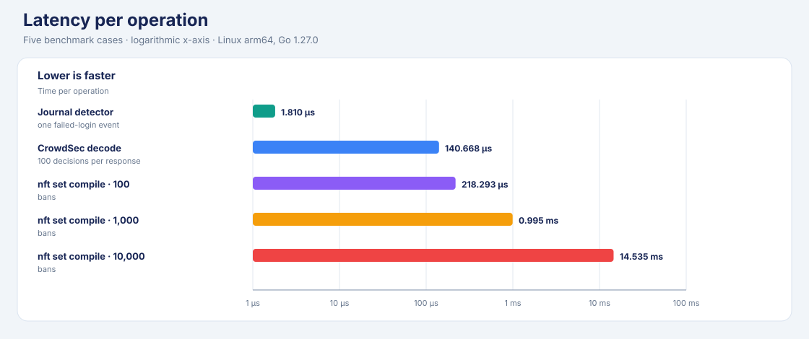
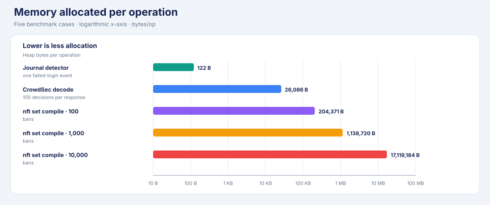
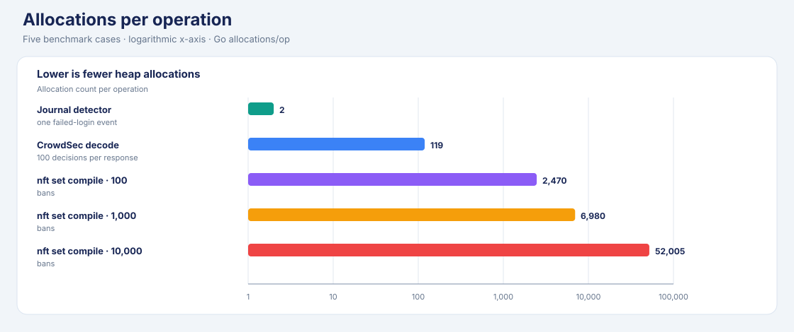

# better-firewall

**better-firewall (`bfw`)** is a Linux firewall manager built on nftables. It offers a familiar UFW-style command line, dual-stack rules, and optional login-abuse protection.

## What you get

- UFW-style rules, policies, logging, and application profiles.
- Atomic nftables updates for IPv4 and IPv6.
- Named IP sets, NAT, expiring rules, and health checks.
- Migration of supported rules from UFW, firewalld, iptables-persistent, and nftables.
- Optional journal-based bans and CrowdSec Local API decisions.

## Install

Requirements: Linux with nftables support and root to change the firewall. Go
1.22+ is required only when building from source.

Install the latest Linux release:

```sh
curl -fsSL https://github.com/tmih06/bfirewall/releases/latest/download/install.sh -o install-bfw.sh
sudo sh install-bfw.sh
```

Or build and install from source:

```sh
make build
sudo make install
```

Installation does **not** replace or disable another firewall manager. Review the rules and migration instructions before taking over an existing firewall.

## Start safely

Allow your actual SSH port and trusted source first. Then preview before enabling:

```sh
sudo bfw allow from 192.0.2.10 to any port 22 proto tcp
sudo bfw --dry-run enable
sudo bfw enable
sudo bfw status verbose
```

Replace `192.0.2.10` and port `22` with your administration address and SSH port. Enabling a deny-by-default firewall without an access rule can lock out remote users.

Useful commands:

| Need | Command |
|---|---|
| Add a rule | `bfw allow 443/tcp`, `bfw deny 23/tcp` |
| Check rules | `bfw status numbered`, `bfw check`, `bfw diff` |
| Preview changes | `bfw --dry-run reload` |
| Manage named addresses | `bfw set create NAME`, then `bfw set add NAME IP` |
| Add NAT | `bfw nat add masquerade out on IFACE` |
| Stop or restore traffic | `bfw disable`, `bfw enable` |

`bfw` can also be invoked as `ufw` for the supported UFW command grammar. `bfw panic` blocks all traffic; use it only when you intend to cut existing connections.

## Optional login protection

Run `bfw protect` to watch systemd journal records and apply temporary firewall bans. The default SSH jail ignores loopback, then bans an address for **1 hour after 5 failed logins within 10 minutes**. Failure counters are in memory; bans persist across restarts. This is Fail2ban-like behavior, not a flat-file Fail2ban replacement.

| Mode | Reads | Needs | Decision handling |
|---|---|---|---|
| Local jail | Configured journal identifiers and regex patterns | systemd journal; no external service | Counts failures, then adds a temporary ban |
| CrowdSec | CrowdSec LAPI decision stream | Bouncer key file; HTTPS (or HTTP on loopback) | Reconciles a startup snapshot, then applies IP/range `ban` deltas |
| Combined | Both sources | Same `bfw protect` service | Both use the same persisted nftables ban sets |

The optional systemd service is installed but not enabled automatically:

```sh
sudo systemctl enable --now better-firewall-protect.service
```

Expired bans are removed by the minutely sweep timer. The firewall service starts that timer; if you run protection without the firewall systemd service, enable `better-firewall-sweep.timer` too. Expiration may be enforced up to one minute late.

### Connect CrowdSec

On the LAPI host, create a bouncer and save its key in a root-only file:

```sh
sudo cscli bouncers add bfirewall
sudo install -o root -g root -m 0600 /dev/null /etc/better-firewall/crowdsec.key
sudoedit /etc/better-firewall/crowdsec.key
```

Add this object to `/etc/better-firewall/protect.json`:

```json
{
  "crowdsec": {
    "url": "https://lapi.example:8080",
    "api_key_file": "/etc/better-firewall/crowdsec.key",
    "poll_interval": "30s"
  }
}
```

Set `"jails": []` if you want CrowdSec only. Only IP and range bans are enforced. The client rejects redirects so it cannot forward the key to another host. TLS client certificates are not supported yet. See the [LAPI protocol notes](docs/crowdsec-lapi-research.md).

## Benchmark evidence

Measured with `make benchmark-protect` on **Linux arm64, Go 1.27.0**. This is
one sample; times vary by machine. Every graph uses a logarithmic axis so the
small and large workloads remain visible. These microbenchmarks do not measure
firewall packet throughput or a protection-disabled baseline.

**Latency per operation**



**Memory allocated per operation**



**Allocations per operation**



| Path | Work per operation | Time | B/op | Allocs/op | Throughput |
|---|---:|---:|---:|---:|---:|
| Journal failure detector | 1 failed-login event | 1.810 µs | 122 | 2 | — |
| CrowdSec JSON decode | 100 decisions | 140.668 µs | 26,086 | 119 | 87.48 MB/s |
| nft ban-set compile | 100 bans | 218.293 µs | 204,371 | 2,470 | — |
| nft ban-set compile | 1,000 bans | 0.995 ms | 1,138,720 | 6,980 | — |
| nft ban-set compile | 10,000 bans | 14.535 ms | 17,119,184 | 52,005 | — |

## Firewall comparison and resource usage

The hosted `performance` job compares **no firewall**, **bfw**, and **UFW** on
the same isolated runner. It tests 10, 100, 500, and 1,000 rules with
keep-alive, new-connection churn, and mixed traffic (three repeats).

| Measure | What the report contains |
|---|---|
| Network behavior | Requests/s, p50/p95/p99 latency, errors, dropped iterations, checks, and bytes transferred |
| Container resources | Average/peak CPU and memory for the firewall server and k6 attacker; sampled every second |
| Rule-application cost | Rule-add and firewall-enable wall time, CPU seconds, and peak RSS for bfw and UFW |
| Footprint | bfw executable, UFW launcher, and installed UFW package sizes |

Open the [CI runs](https://github.com/tmih06/better-firewall/actions/workflows/ci.yml)
and select the latest successful **Consolidate performance report** job. Its
`better-firewall-performance` artifact contains `summary.md`, `summary.json`,
and raw run data (retained for 30 days). New successful runs also display the
Markdown report in the job summary.

## Migrate an existing firewall

Preview first, then take over only when the output is correct:

```sh
sudo bfw --dry-run migrate --from auto --replace
sudo bfw migrate --from auto --replace --takeover
```

Migration supports supported rules from UFW, firewalld, iptables-persistent, and nftables. Unsupported enforcement semantics stop the import rather than being silently broadened or dropped. `--takeover` stops and disables the source manager; inspect the live ruleset before and after.

## Develop and test

```sh
make test               # unprivileged unit tests
make check              # formatting, vet, static analysis, shell checks, vulnerability scan
make package            # staged install and systemd-unit validation
make benchmark-protect  # safe local protection microbenchmarks
```

CI runs build, race-test, package, security, and protection-benchmark jobs. Kernel integration tests and the UFW traffic benchmark run only on isolated GitHub-hosted runners. **Do not run those privileged workloads on a workstation or production host.** See [CI](.github/workflows/ci.yml).

## License

No license file is present; treat the project as all-rights-reserved.
