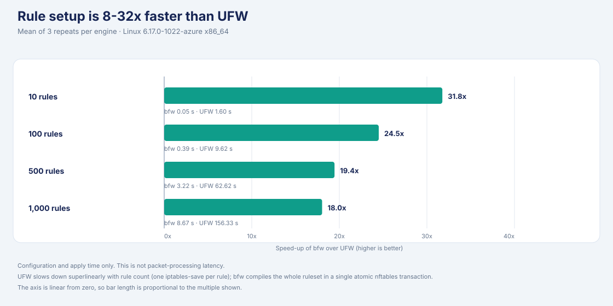
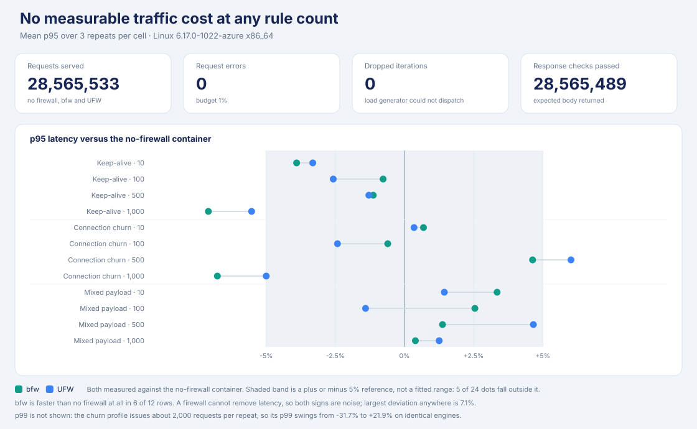
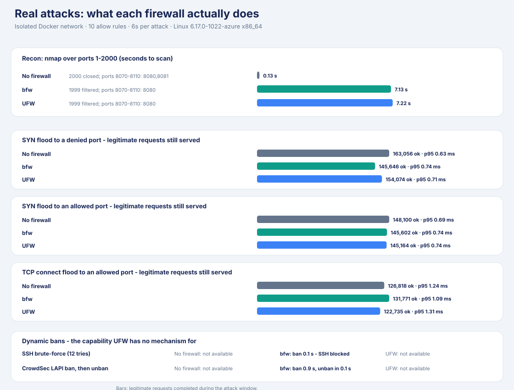

# better-firewall

**better-firewall (`bfw`)** is a Linux firewall manager built on nftables, with a UFW-style command line, dual-stack rules, and optional login-abuse protection.

- UFW-style rules, policies, logging, and application profiles.
- Atomic nftables updates for IPv4 and IPv6.
- Named IP sets, NAT, expiring rules, and health checks.
- Migration of supported rules from UFW, firewalld, iptables-persistent, and nftables.
- Optional journal-based bans and CrowdSec Local API decisions.

## Install

Requires Linux with nftables support and root. Go 1.22+ only when building from source.

```sh
curl -fsSL https://github.com/tmih06/bfirewall/releases/latest/download/install.sh -o install-bfw.sh
sudo sh install-bfw.sh
```

Or from source:

```sh
make build
sudo make install
```

Installing does **not** replace or disable another firewall manager. Review the rules before taking over an existing one.

## Start safely

Allow your real SSH port and trusted source first, then preview before enabling:

```sh
sudo bfw allow from 192.0.2.10 to any port 22 proto tcp
sudo bfw --dry-run enable
sudo bfw enable
sudo bfw status verbose
```

Replace `192.0.2.10` and port `22` with your administration address and SSH port. Enabling a deny-by-default firewall without an access rule locks out remote users.

| Need | Command |
|---|---|
| Add a rule | `bfw allow 443/tcp`, `bfw deny 23/tcp` |
| Check rules | `bfw status numbered`, `bfw check`, `bfw diff` |
| Preview changes | `bfw --dry-run reload` |
| Manage named addresses | `bfw set create NAME`, then `bfw set add NAME IP` |
| Add NAT | `bfw nat add masquerade out on IFACE` |
| Stop or restore traffic | `bfw disable`, `bfw enable` |

`bfw` also answers to `ufw` for the supported UFW grammar. `bfw panic` blocks all traffic; use it only when you mean to cut live connections.

## Login protection

`bfw protect` watches systemd journal records and applies temporary bans. The default SSH jail ignores loopback and bans an address for **1 hour after 5 failed logins within 10 minutes**. Counters are in memory; bans persist across restarts. This is Fail2ban-*like*, not a flat-file Fail2ban replacement.

| Mode | Reads | Needs | Handling |
|---|---|---|---|
| Local jail | Configured journal identifiers and regexes | systemd journal only | Counts failures, adds a temporary ban |
| CrowdSec | CrowdSec LAPI decision stream | Bouncer key; HTTPS, or HTTP on loopback | Reconciles a startup snapshot, applies IP/range `ban` deltas |
| Combined | Both | Same `bfw protect` service | Share the same persisted nftables ban sets |

The systemd service is installed but not enabled:

```sh
sudo systemctl enable --now better-firewall-protect.service
```

The minutely sweep timer removes expired bans. The firewall service starts it; if you run protection without that service, enable `better-firewall-sweep.timer` yourself. Expiry can run up to a minute late.

### Connect CrowdSec

Create a bouncer on the LAPI host and save its key in a root-only file:

```sh
sudo cscli bouncers add bfirewall
sudo install -o root -g root -m 0600 /dev/null /etc/better-firewall/crowdsec.key
sudoedit /etc/better-firewall/crowdsec.key
```

Then add this to `/etc/better-firewall/protect.json`:

```json
{
  "crowdsec": {
    "url": "https://lapi.example:8080",
    "api_key_file": "/etc/better-firewall/crowdsec.key",
    "poll_interval": "30s"
  }
}
```

Set `"jails": []` for CrowdSec only. Only IP and range bans are enforced. The client rejects redirects so it cannot leak the key to another host; TLS client certificates are not supported yet. See the [LAPI protocol notes](docs/crowdsec-lapi-research.md).

## Performance

All numbers below come from hosted CI runs and are regenerated from the raw
artifacts by `make charts`, so they cannot drift out of sync with the data.

### Rule setup is 8–32× faster than UFW



| Rules | bfw | UFW | Faster by |
|---:|---:|---:|---:|
| 10 | 0.05 s | 1.60 s | 31.8× |
| 100 | 0.39 s | 9.62 s | 24.5× |
| 500 | 3.22 s | 62.62 s | 19.4× |
| 1,000 | 8.67 s | 156.33 s | 18.0× |

UFW rewrites and reloads the whole ruleset once per rule, so its time grows
superlinearly. bfw stores configuration and compiles the entire ruleset into a
single atomic nftables transaction. This is configuration time, not packet
latency. Each panel has its own axis — compare the two bars inside a panel, not
bar lengths across panels.

### No measurable traffic cost



Across every scenario in the run — no firewall, bfw and UFW, at 10, 100, 500 and
1,000 rules, under keep-alive, connection-churn and mixed traffic:

- **28,565,533 requests, 0 errors, 0 dropped iterations**
- **28,565,489 response checks passed** (every request returned the expected body)
- Denied traffic stayed denied, allowed traffic passed, and the no-firewall
  baseline stayed unfiltered
- Largest p95 deviation from the no-firewall container anywhere in the run:
  **7.1%**

The deviations fall on both sides of zero: bfw comes out *faster than no firewall
at all* in 6 of the 12 cells. A firewall cannot remove latency, so both signs are
measurement noise rather than overhead. The job also asserts error-rate, p95
latency and check-rate thresholds and fails CI on violation, so this is gated
rather than merely observed.

Two earlier versions of this chart were removed. Grouped bars of absolute
latency put three near-identical bars in each of twelve groups, which cannot
express "no difference" — the reader has to hunt for a difference that is not
there. Plotting bfw/UFW *ratios* was worse: all twelve values fell between 0.969
and 1.040, and the note explaining that the spread was noise was longer than the
claim it qualified.

p99 is deliberately not charted. The churn profile issues about 2,000 requests
per repeat, so its p99 is the 20th-worst sample and swings from −31.7% to +21.9%
between neighbouring rule counts on identical engines.

### Real attacks

A separate hosted job drives real attacks at the defended container — nmap
recon, hping3 SYN floods against both denied and allowed ports, a TCP connect
flood, 12 SSH brute-force attempts, and ban/unban pushes through a
CrowdSec-compatible LAPI — while an independent client keeps measuring
legitimate traffic. Engines: no firewall, bfw, and UFW, 10 allow rules, 6 s per
attack.



| Measure | No firewall | bfw | UFW |
|---|---:|---:|---:|
| nmap ports 1–2000 | 2,000 closed in 0.13 s | 1,999 filtered in 7.13 s | 1,999 filtered in 7.22 s |
| Ports visible in 8070–8110 | 8080, 8081 | 8080 only | 8080 only |
| Legit requests, SYN flood → denied | 163,056 | 145,646 | 154,074 |
| Legit requests, SYN flood → allowed | 148,100 | 145,602 | 145,164 |
| Legit requests, connect flood | 126,818 | 131,771 | 122,735 |
| Failed legitimate requests | 0 | 0 | 0 |
| SSH brute-force, 12 tries | attacker unbanned | **banned in 0.1 s, SSH blocked** | attacker unbanned |
| LAPI ban → attacker | — | **blocked in 0.9 s, unbanned in 0.1 s** | not supported |

Under either firewall, recon becomes seconds of filtered ports instead of
instant answers, and legitimate traffic survives every flood with no failures.
The last two rows are the reason to choose bfw: UFW has no mechanism for
dynamic bans, while `bfw protect` banned the brute-forcer 0.1 s after the fifth
failed login and applied a LAPI decision 0.9 s after it was pushed, without
touching the legitimate stream.

### Internal microbenchmarks

Microbenchmarks of individual Go functions (journal parsing, CrowdSec decoding,
ban-set and ruleset compilation, rendering, rule lookup) are in
[docs/benchmarks.md](docs/benchmarks.md). They are generated from the raw
`go test -bench` output and measure internal code paths, not packet handling.

## Migrate an existing firewall

Preview first, then take over only when the output is correct:

```sh
sudo bfw --dry-run migrate --from auto --replace
sudo bfw migrate --from auto --replace --takeover
```

Migration supports supported rules from UFW, firewalld, iptables-persistent, and nftables. Unsupported enforcement semantics stop the import rather than being silently broadened or dropped. `--takeover` stops and disables the source manager; inspect the live ruleset before and after.

## Develop and test

```sh
make test               # unprivileged unit tests
make check              # formatting, vet, static analysis, shell checks, vulnerability scan
make package            # staged install and systemd-unit validation
make benchmark-protect  # safe local protection and ruleset microbenchmarks
make charts             # regenerate charts and docs/benchmarks.md from scripts/charts/testdata/
```

Charts and [docs/benchmarks.md](docs/benchmarks.md) are generated by
`scripts/charts/charts.py` from the committed snapshot in
`scripts/charts/testdata/`, which is why the numbers above cannot go stale. To
publish a new run, download the `performance`, `protection-benchmarks` and
`better-firewall-attack` CI artifacts into one directory and run
`python3 scripts/charts/charts.py <dir>`.

CI runs build, race-test, package, security, and protection-benchmark jobs. Kernel integration tests, the UFW traffic benchmark, and the attack-lab comparison run only in isolated GitHub-hosted runners. **Do not run those privileged workloads on a workstation or production host.** See [CI](.github/workflows/ci.yml).

## License

No license file is present; treat the project as all-rights-reserved.
